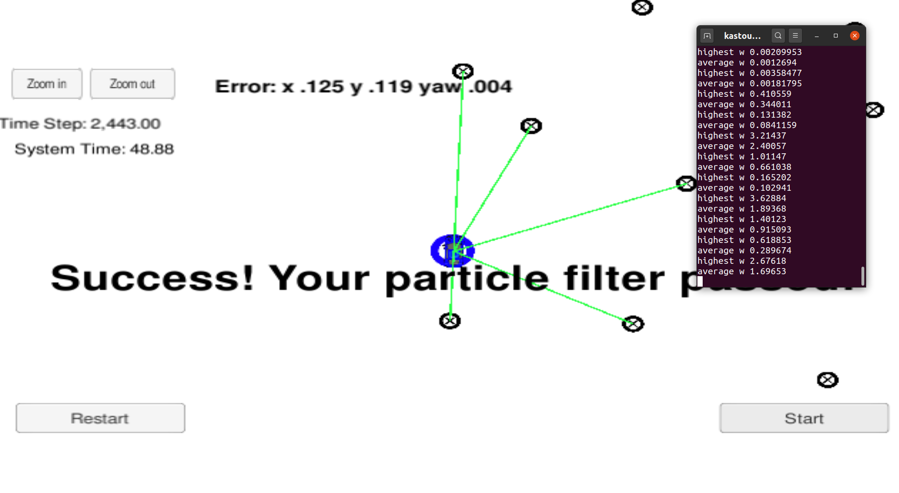
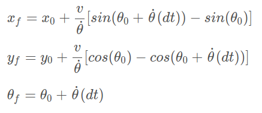

[bicycle_model]: ./doc/bicycle_model.png "Model Visualization"

# Overview
This repository contains my implementation of the final project for the Localization course in Udacity's Self-Driving Car Nanodegree.
The original Udacity repository can be found [here](https://github.com/udacity/CarND-Kidnapped-Vehicle-Project)

## Project Introduction
Your robot has been kidnapped and transported to a new location! Luckily it has a map of this location, a (noisy) GPS estimate of its initial location, and lots of (noisy) sensor and control data.

In this project you will implement a 2 dimensional particle filter in C++. Your particle filter will be given a map and some initial localization information (analogous to what a GPS would provide). At each time step your filter will also get observation and control data.
<div style="text-align:center">
</div>


##  Implementation of the Particle Filter
### Initialization: 
The filter starts with initializing the particles. The initialization is composed of the following steps:
* First the number of particles is set
* The coordinates x, y and the orientation (yaw) are generate using a gaussian distribution centered at the initial given GPS estimate.
* The weights of the particles are set to 1.
### Prediction:
Given the (noisy) control data (velocity und the yaw rate) , the new postion of each particle is predicted. A random erßror is added to the predicted values to accoun for the noise in the measurement.
If the yaw rate is large enough, a bicycle model is used to predict the particle's new position.

<div style="text-align:center">
</div>


To avoid a zero division, a linear motion model is used if the yaw rate is too small.

### Update:
In the update step the weight of each particle is recalculated.
For each observation : 
* the observation is transformed from the partile's cooridinate system to the maps coordinate system. The transformation is done using a homogeneous transformation.
* the observation is than matched to the closest landmark and the probabity that the observation corresponds to the chosen landmark is calculated.
* the total weight of the paticle is calculated as the product of all the probabilities of the observations.
### Resampling
The resampling follows the survival of the fittest principle, i.e the particles that are more lilely to descripe the car's true location should survive.
I used the wheel approach described in the lessons. The particles with the largest weights are more likely to get picked.

## demo 
The following animations shows how the filter successfully localizes the car. The blue cicle shows the position estimated by the filter (with 50 particles). 
<div style="text-align:center">
</div>


## How many particles are needed ?
30 particles are already enough to meet the project requirements. 
The followign table shows some experiments with diffirent number of particles:

| number of particles      | x-error    | y-error     | yaw-error| time | 
| :------------- | :----------: | :-----------: |:-----------: |-----------: |
| 20 | FAILED   | FAILED    | FAILED    | FAILED
| 30 | 0.123   | 0.126    | 0.005    | 48.86 
| 40 | 0.125   | 0.115    | 0.004    | 48.86
| 40 | 0.125   | 0.115    | 0.004    | 48.86
| 100 | 0.114 | 0.110 | 0.004 | 48.86
| 500 | 0.122   | 0.114    | 0.005    | 49.02
| 1000 | 0.109   | 0.103    | 0.004    | 71.66

Screen shots of the experiment can be found in ./doc.

## Running the Code
This project involves the Term 2 Simulator which can be downloaded [here](https://github.com/udacity/self-driving-car-sim/releases)

This repository includes two files that can be used to set up and install uWebSocketIO for either Linux or Mac systems. For windows you can use either Docker, VMware, or even Windows 10 Bash on Ubuntu to install uWebSocketIO.

Once the install for uWebSocketIO is complete, the main program can be built and ran by doing the following from the project top directory.

1. mkdir build
2. cd build
3. cmake ..
4. make
5. ./particle_filter

Alternatively some scripts have been included to streamline this process, these can be leveraged by executing the following in the top directory of the project:

1. ./clean.sh
2. ./build.sh
3. ./run.sh

Tips for setting up your environment can be found [here](https://classroom.udacity.com/nanodegrees/nd013/parts/40f38239-66b6-46ec-ae68-03afd8a601c8/modules/0949fca6-b379-42af-a919-ee50aa304e6a/lessons/f758c44c-5e40-4e01-93b5-1a82aa4e044f/concepts/23d376c7-0195-4276-bdf0-e02f1f3c665d)

Note that the programs that need to be written to accomplish the project are src/particle_filter.cpp, and particle_filter.h

The program main.cpp has already been filled out, but feel free to modify it.

Here is the main protocol that main.cpp uses for uWebSocketIO in communicating with the simulator.

INPUT: values provided by the simulator to the c++ program

// sense noisy position data from the simulator

["sense_x"]

["sense_y"]

["sense_theta"]

// get the previous velocity and yaw rate to predict the particle's transitioned state

["previous_velocity"]

["previous_yawrate"]

// receive noisy observation data from the simulator, in a respective list of x/y values

["sense_observations_x"]

["sense_observations_y"]


OUTPUT: values provided by the c++ program to the simulator

// best particle values used for calculating the error evaluation

["best_particle_x"]

["best_particle_y"]

["best_particle_theta"]

//Optional message data used for debugging particle's sensing and associations

// for respective (x,y) sensed positions ID label

["best_particle_associations"]

// for respective (x,y) sensed positions

["best_particle_sense_x"] <= list of sensed x positions

["best_particle_sense_y"] <= list of sensed y positions


Your job is to build out the methods in `particle_filter.cpp` until the simulator output says:

```
Success! Your particle filter passed!
```

# Implementing the Particle Filter
The directory structure of this repository is as follows:

```
root
|   build.sh
|   clean.sh
|   CMakeLists.txt
|   README.md
|   run.sh
|
|___data
|   |   
|   |   map_data.txt
|   
|   
|___src
    |   helper_functions.h
    |   main.cpp
    |   map.h
    |   particle_filter.cpp
    |   particle_filter.h
```

The only file you should modify is `particle_filter.cpp` in the `src` directory. The file contains the scaffolding of a `ParticleFilter` class and some associated methods. Read through the code, the comments, and the header file `particle_filter.h` to get a sense for what this code is expected to do.

If you are interested, take a look at `src/main.cpp` as well. This file contains the code that will actually be running your particle filter and calling the associated methods.

## Inputs to the Particle Filter
You can find the inputs to the particle filter in the `data` directory.

#### The Map*
`map_data.txt` includes the position of landmarks (in meters) on an arbitrary Cartesian coordinate system. Each row has three columns
1. x position
2. y position
3. landmark id

### All other data the simulator provides, such as observations and controls.

> * Map data provided by 3D Mapping Solutions GmbH.

## Success Criteria
If your particle filter passes the current grading code in the simulator (you can make sure you have the current version at any time by doing a `git pull`), then you should pass!

The things the grading code is looking for are:


1. **Accuracy**: your particle filter should localize vehicle position and yaw to within the values specified in the parameters `max_translation_error` and `max_yaw_error` in `src/main.cpp`.

2. **Performance**: your particle filter should complete execution within the time of 100 seconds.

## How to write a README
A well written README file can enhance your project and portfolio.  Develop your abilities to create professional README files by completing [this free course](https://www.udacity.com/course/writing-readmes--ud777).
